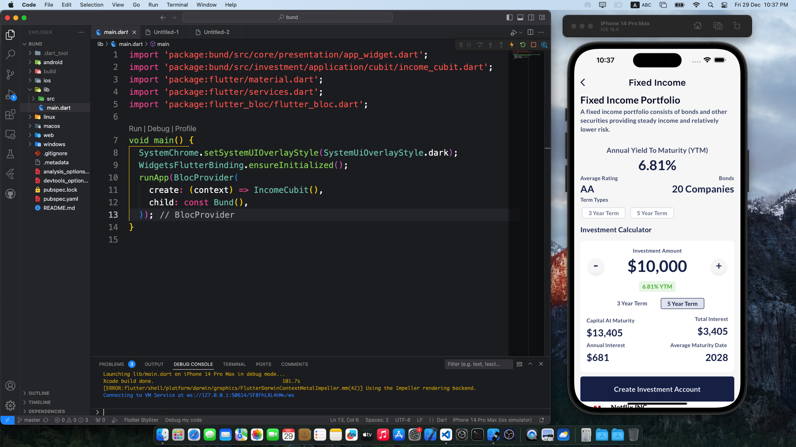

# bund

- [Youtube Video Link](https://youtube.com/shorts/QEK6zif-71M?si=U9U3ntNoKTb5IHs1)

## screenshots

  
  
  
  
  
  
  
  
  
  

- Layout and Design

Accurate color scheme ✅
Font styles and sizes ✅
Element positioning and spacing ✅
Consistent theming across UI components ✅

- Interactive Investment Calculator

Increment the investment amount by $10,000, unless it is below or equal to $10,000, in which case it should
increment or decrement by $1,000 until it reaches the minimum of $250. ✅
Implement exponential incrementation when the plus or minus button is held down. ✅
Include a user experience (UX) element indicating that the button can be held (e.g., a visual cue and/or   haptic feedback). ✅
all calculations are performed accurately and displayed dynamically ✅

- Data Handling: Integrate a mock data service to simulate fetching and updating bond information ✅

- Code Organization: Write clean, modular code with clear naming conventions and proper comments, adhering to  Dart/Flutter best practices. ✅

- Interactive Animations: Create smooth and responsive animations that activate during user interactions with the calculator and the list of bonds.  ✅

- State Management: Utilize a bloc state management solution to manage the state of the application efficiently. ✅

- Custom Theme: Develop a custom Flutter theme to apply across the app for styling consistency. ✅

- Responsive Design: Make sure the page is responsive and renders well on different device sizes and orientations.✅

- Networking: Simulate API calls with loading indicators when the investment data is 'fetched' or 'updated'.✅

- Documentation: Provide a README file with instructions on how to set up and run the project, including any necessary commands or dependencies. 😊
- Snap Page Scrolling: 

Implement snap scrolling to allow users to navigate through different sections of the Home Screen seamlessly.✅
Each scroll 'snap' should correspond to a discrete section of the page for focused user engagement.✅

- Dynamic Card Updates:

Cards displaying information should have a mechanism to update content dynamically.✅
Upon update, cards should briefly flash with a semi-transparent overlay, signaling content change to the user without being intrusive.✅
Swipeable Interface:
Enable horizontal swiping to navigate through different pages or tabs of the Home Screen.✅
Ensure smooth transition animations between pages to enhance user interaction.✅

- Integration Tab Navigation:

Implement a tab labeled 'Integration' that, when tapped, transitions the user to the 'Fixed Income' page with a fluid animation.✅
This navigation should simulate a real-life application flow where different financial products are interconnected.✅

- Global Animations:

Incorporate subtle animations throughout the Home Screen that activate upon user interactions such as tapping, scrolling, or swiping.✅
Animations should be consistent with the design language and enhance the user experience without overwhelming the content.✅

